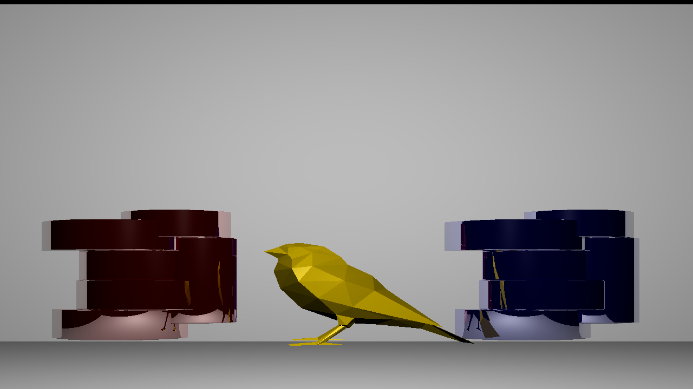

# Raytracer

A simple educational **Java ray tracer** that renders 3D scenes into 2D images using ray tracing techniques.

This project traces the paths of rays from a virtual camera into a scene of objects and lights, computing color, shading, and reflections to produce realistic images.

---

## 📸 Example Output



---

## 🚀 Features

This ray tracer implements the core ideas of ray tracing:

✔ Camera and viewing rays  
✔ Scene with geometric primitives (spheres, planes, etc.)  
✔ Material shading models (e.g., Lambertian diffuse, Phong/specular)  
✔ Basic lighting  
✔ Recursive reflections  
✔ Image output in simple format (e.g., PPM, PNG)  


---

## 🧠 How It Works

Ray tracing works by shooting rays from the camera into the scene, finding intersections with objects, and computing lighting at the hit points using material and light information. This simulation of light paths allows for realistic shading, shadows, and reflections.

---

## 📦 Getting Started

### Requirements

- Java 8 or higher  

### Build & Run

##### 1. Clone the repository:

   ```bash
   git clone https://github.com/PabloUsc/Raytracer.git
   cd Raytracer
   ```

##### 2. Compile:

javac -d out src/edu/up/isgc/raytracer/*.java

##### 3. Run:

java -cp out edu.up.isgc.raytracer.Main

The rendered image will be saved into the main folder.

#### Configuration

You can configure the scene in the main Raytracer file, including:

- Image resolution
- Background color
- Material properties (diffuse, specular, reflectivity)
- Light positions & colors

External 3D models can be added through .OBJ files, and must be inside **models** folder.

---

## 📁 Project Structure

```
Raytracer/
├── src/
│   └── edu/up/isgc/raytracer/      # Source code
├── example_outputs/                # Example renders
├── models/                         # OBJ models used in raytracer
└── README.md
```